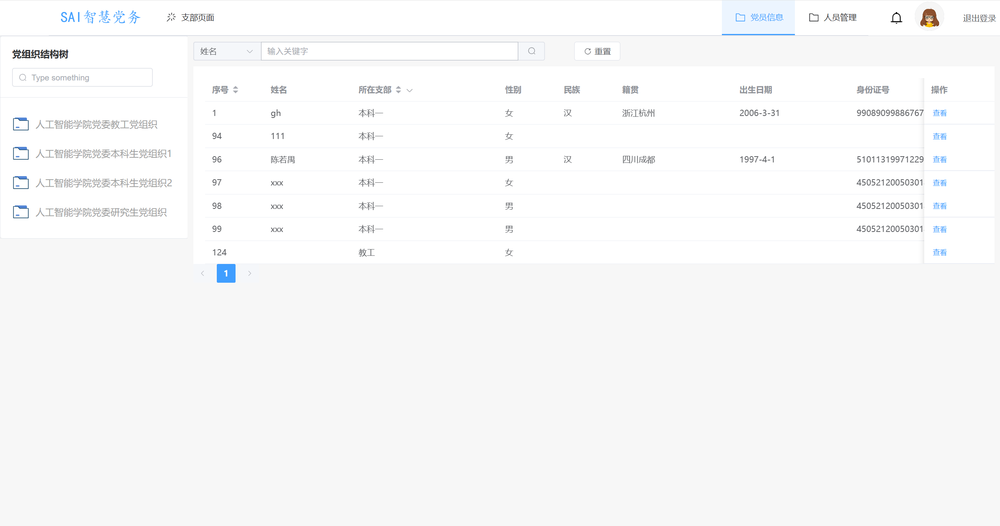
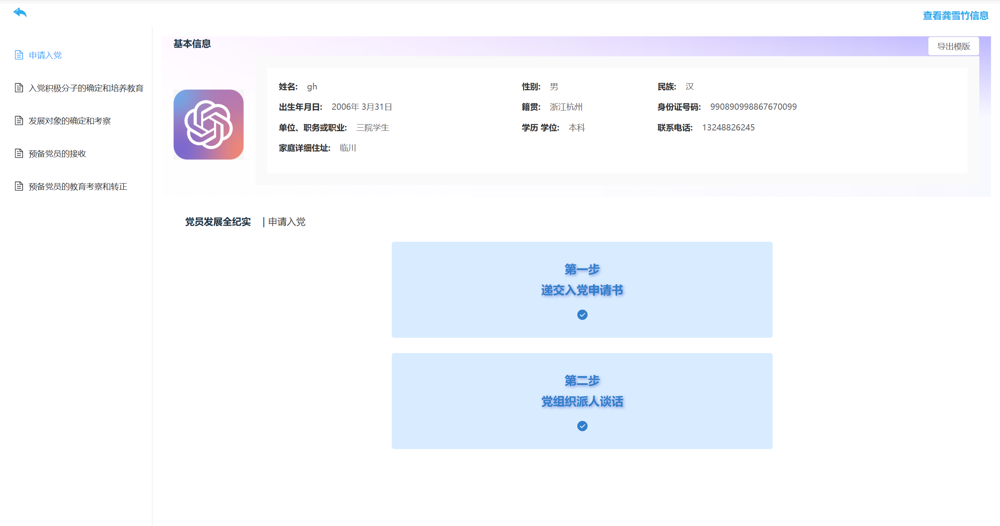
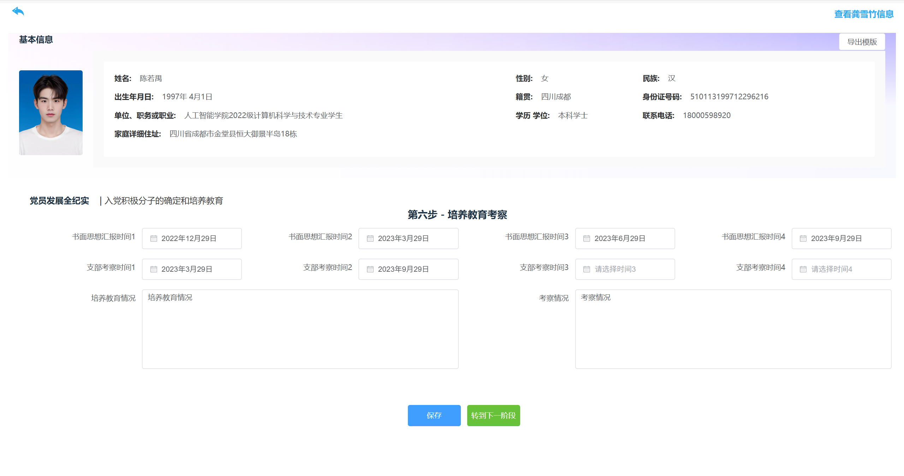
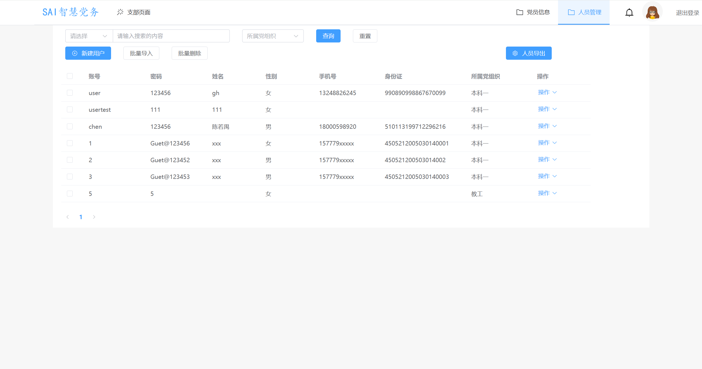
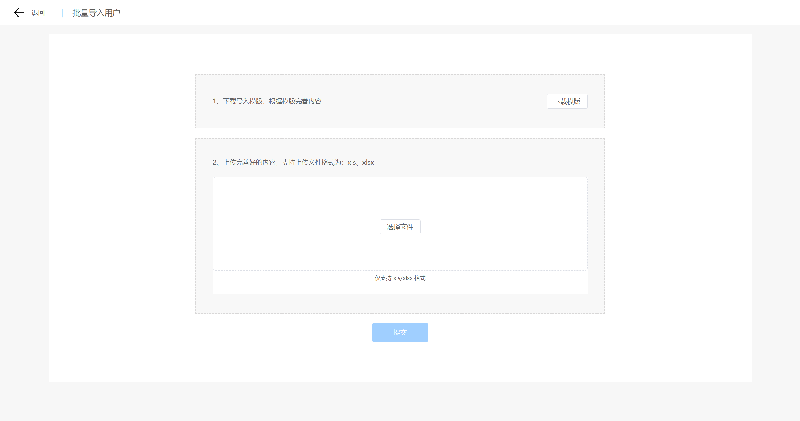

# 项目介绍

    本项目是学院的一个党员信息录入的系统，主要分为三个用户：党员，党委，支部，主要通过支部对于党员的信息录入，生成对应的模本供党员下载；
    党委主要是用来管用要管理支部账号的，当然，支部的一些功能他都有
    项目主要可以进行人员的批量导入，还有生成pdf模版下载，以及动态的生成各个步骤需要的表格，还通过axios全局封装，做了一些数据预处理

# 项目展示

# 目录结构描述

    ─src
    │  App.vue
    │  auto-imports.d.ts
    │  main.ts
    │  style.css
    │  vite-env.d.ts
    │
    ├─assets
    │  ├─css
    │  │      common.scss
    │  │      index.scss
    │  │      reset.scss
    │  │
    │  ├─icons
    │  │      folder.svg
    │  │      return_back.svg
    │  │
    │  └─images
    │          login-bgc.gif
    │          work.svg
    │
    ├─components
    │  │  Back.vue
    │  │  Header.vue
    │  │  index.ts
    │  │
    │  ├─AllPnumberInfo
    │  │  │  PnumberInfo.vue
    │  │  │
    │  │  └─service
    │  │          index.ts
    │  │
    │  ├─baseInfo
    │  │      index.vue
    │  │      service.ts
    │  │
    │  ├─login
    │  │  │  index.vue
    │  │  │
    │  │  └─service
    │  │          login.ts
    │  │
    │  ├─state
    │  │      StateMenu.vue
    │  │
    │  ├─SvgIcon
    │  │      index.vue
    │  │
    │  └─User
    │      │  importUser.vue
    │      │  index.vue
    │      │  mockData.js
    │      │  newUser.vue
    │      │  updateUser.vue
    │      │
    │      ├─service
    │      │      index.ts
    │      │
    │      └─type
    │              index.ts
    │
    ├─Mock
    │      mockData.ts
    │
    ├─router
    │      index.ts
    │
    ├─service
    │  │  index.ts
    │  │
    │  ├─config
    │  │      index.ts
    │  │
    │  └─request
    │          index.ts
    │          type.ts
    │
    ├─stores
    │  │  index.ts
    │  │  pnumber.store.ts
    │  │  user.store.ts
    │  │
    │  └─memberInfo
    │      │  memberInfo.ts
    │      │
    │      └─service
    │              index.ts
    │
    └─views
        ├─Branch
        │  │  index.vue
        │  │
        │  ├─MemberInfo
        │  │      index.vue
        │  │
        │  ├─Personnel
        │  │      index.vue
        │  │
        │  └─service
        │          index.ts
        │
        ├─Committee
        │  │  index.vue
        │  │
        │  ├─BranchManage
        │  │      index.vue
        │  │
        │  ├─MemberInfo
        │  │      index.vue
        │  │
        │  ├─Personnel
        │  │      index.vue
        │  │
        │  └─service
        │          index.ts
        │
        ├─Error
        │      403.vue
        │      404.vue
        │
        ├─LoginView
        │      index.vue
        │
        ├─Member
        │  │  index.vue
        │  │
        │  ├─BasicInformation
        │  │  │  index.vue
        │  │  │
        │  │  ├─info
        │  │  │      index.vue
        │  │  │      UserInfoDisplay.vue
        │  │  │      UserInfoEdit.vue
        │  │  │
        │  │  └─service
        │  │          index.ts
        │  │
        │  └─Download
        │      │  index.vue
        │      │
        │      └─service
        │              index.ts
        │
        ├─Progress
        │  │  index.vue
        │  │  StepInfoDetail-fuben.vue
        │  │  StepInfoDetail-fuben2.vue
        │  │  StepInfoDetail.vue
        │  │
        │  ├─children
        │  │  ├─branch
        │  │  │      index.vue
        │  │  │
        │  │  └─committee
        │  │          index.vue
        │  │
        │  ├─components
        │  │      DataDisplay.vue
        │  │      DataEditor.vue
        │  │      StepContainer.vue
        │  │
        │  ├─Data
        │  │      formData.ts
        │  │
        │  ├─service
        │  │      index.ts
        │  │      style.ts
        │  │
        │  └─store
        │          baseInfo.store.ts
        │          stepCard.store.ts
        │
        └─User
            │  importUser.vue
            │  index.vue
            │  mockData.js
            │  newUser.vue
            │  updateUser.vue
            │
            ├─service
            │      index.ts
            │
            └─type
                    index.ts

- Branch 有关支部的页面
- Committee 有关党委的页面
- Member 有关党委的页面
- Progress 是支部和党委都能进去，主要就是看每个党委的进展情况和信息录入
- service 用来写请求接口
- router 路由
- common.scss 公用样式
- 里面还有许多废弃掉的文件，因为写的时候需求一直变动就没删
